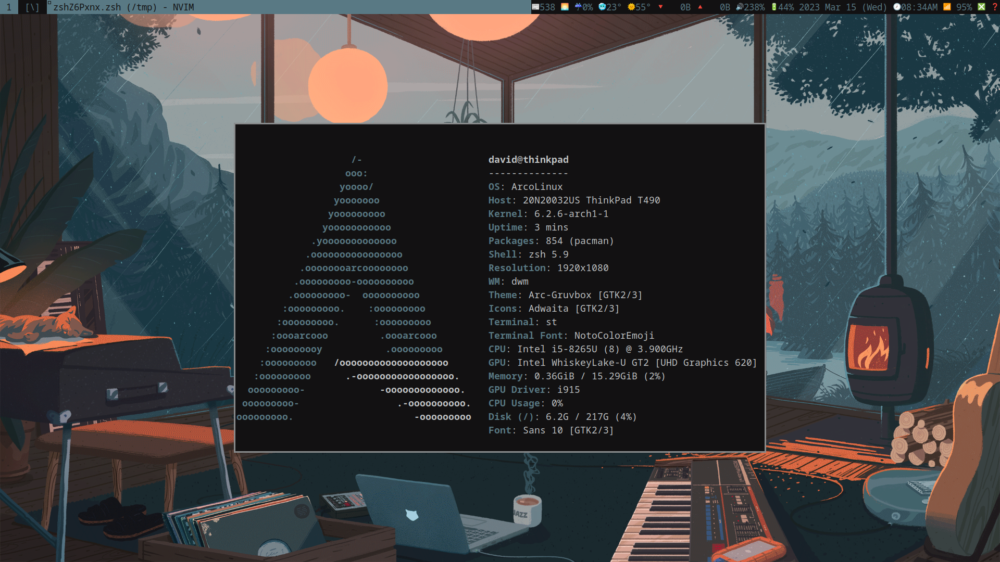

# ArcoLARBS



### About

Don't want to deal with installing Arch Linux? Don't want to spend forever configuring every little aspect of your linux build? Want to post screenshots to r/unixporn? Then ArcoLARBS is for you! 

ArcoLARBS is an easy to install linux operating system (well, not technically but who cares, right?). Built on ArcoLinux (a derivative of Arch) and configured using Luke Smith's Auto-Bootstrapping Script (LARBS), ArcoLARBS is almost entirely the work of other people. But I'm lazy and I don't want to reinvent the wheel (read: reinstall and configure Arch for the hunderth time) and so here we are.

ArcoLARBS can be installed in about 10 minutes, customized in about five, and before you know it you'll be posting those sweet screenshots to r/unixporn. Because that's why we're really here, right?

### Installation

1. Download the ArcoLinuxD iso image:

```
wget https://sourceforge.net/projects/arcolinux/files/ArcoLinuxD/arcolinuxd-v23.03.01-x86_64.iso/download
```


2. Write the iso image to a bootable media device. In this case, we'll be using the linux utility `dd`. Make sure to substitute `of=/dev/sdb` with the correct block device! 

```
dd if=arcolinuxd-v23.03.01-x86_64.iso of=/dev/sdb
```


3. Follow the ArcoLinuxD install directions [here](https://www.arcolinuxd.com/installation/) or [here](https://www.youtube.com/watch?v=B6TpyG2tIV0)


4. After install, update the system.

```
sudo pacman -Syyu
```


5. Install Luke's Auto-Rice Bootstrapping Scripts (LARBS). Simply download and run the script and follow the instructions in the installer.

```
curl -LO larbs.xyz/larbs.sh
```
```
sh larbs.sh
```


6. Reboot the system and enjoy your life as an ArcoLARBer!


### Post-Install (Optional)

Adding a custom wallpaper and corresponding colorscheme is simple with ArcoLARB.

1. Download a wallpaper and set it as the background. Replace 'wallpaper.jpg' with the appropriate links. 

```
wget wallpaper.jpg
```
``` 
setbg /path/to/wallpaper.jpg
```

2. To generate a custom colorscheme based on your wallpaper, install and run `wal`:

```
sudo pacman -S python-pywal
```
```
wal -i /path/to/wallpaper.jpg
```

3. Enjoy your new wallpaper and colorscheme!

### Keybindings


### Links 


 

 
